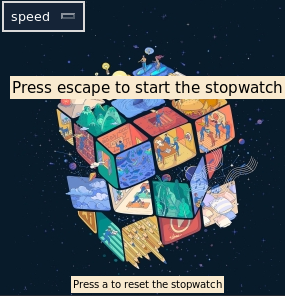

# A Rubik's cube stopwatch (with InfluxDb)
A stopwatch designed to be used to time a rubik's cube solving and send the results to a InfluxDB database. Used as a i3blocks widget. 

Be sure to have tkinter installed (`python3`):

`sudo apt install python3-tk`

This require Influx db client: [influxdb_client doc](https://influxdb-client.readthedocs.io/en/stable/)

`pip3 install influxdb_client`

This will open a Tkinter window. Press `espace` to start the stopwatch. Good luck!

